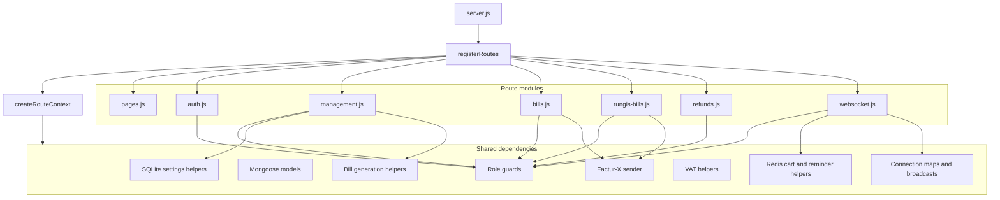
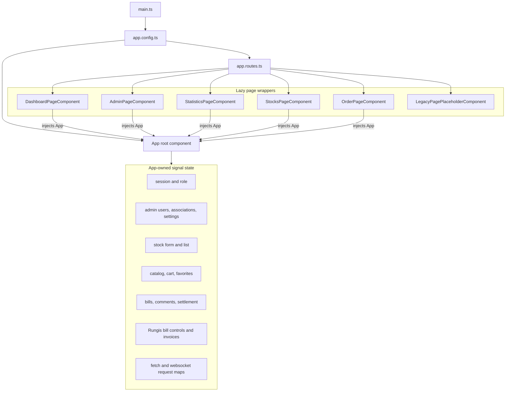
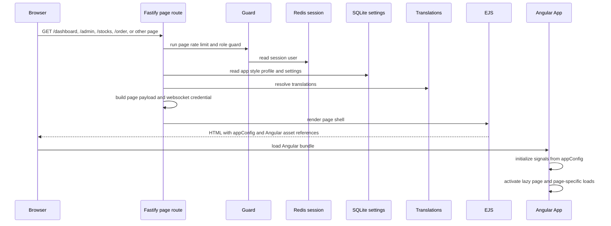
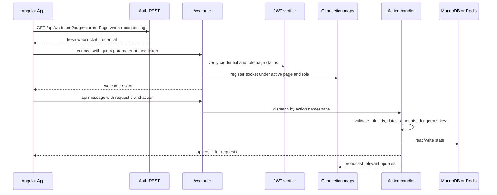
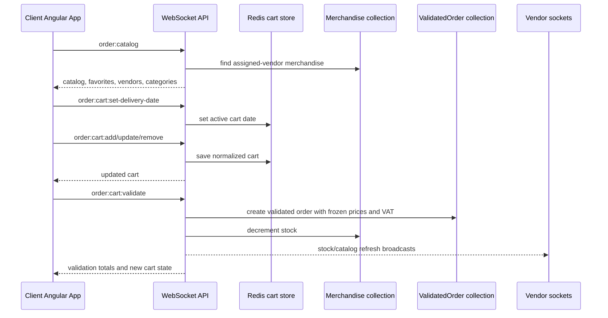
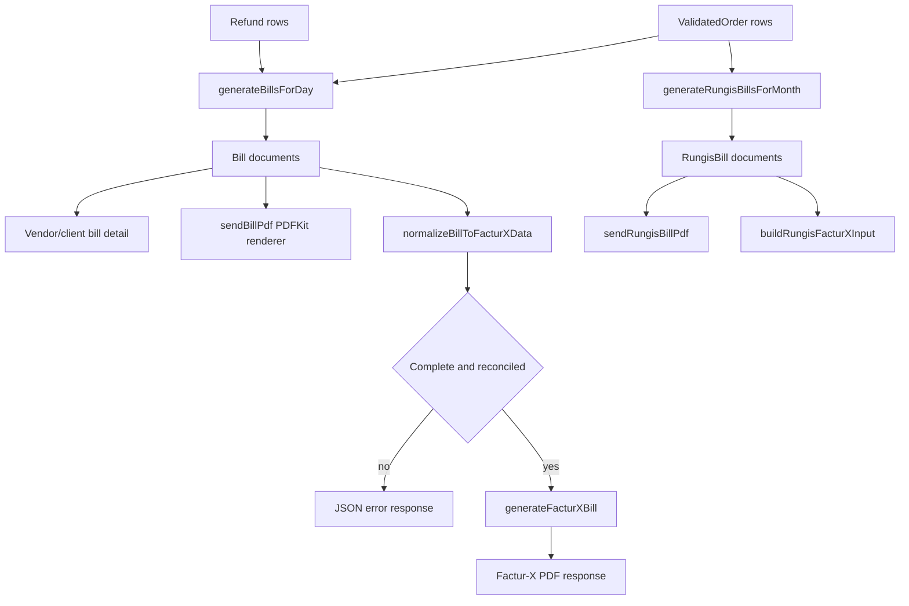
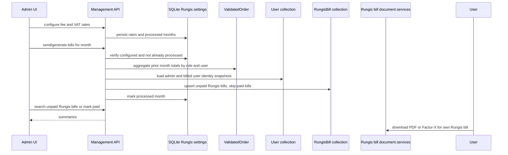

# Rungis Runtime Flows and Component Interactions

Generated: 2026-06-21 03:29:57 CEST

## Evidence

- Codebase-memory project: `Volumes-WDBlack4TB-Code-rungis`
- Index status: ready, 2962 nodes, 4520 edges
- Route trace: `registerRoutes` registers page, auth, management, bill, Rungis bill, refund, and websocket modules
- WebSocket action inventory from `backend/src/routes/modules/websocket.js`
- REST route inventory from route modules and generated runtime API docs

## 1. Runtime container view

```mermaid
flowchart LR
    Admin[Admin user]
    Vendor[Vendor user]
    Client[Client user]

    subgraph Browser[Browser]
        EJS[EJS shell]
        Angular[Angular 22 App]
        Lazy[Lazy page wrappers]
        Toasts[Toast and alert stack]
        WSClient[WebSocket client]
    end

    subgraph Fastify[Fastify process]
        Plugins[Cookie, form body, session, JWT, websocket, view, static]
        Pages[Page routes]
        Rest[REST APIs]
        WS[/ws API]
        Context[Route context]
        Docs[PDF and Factur-X services]
    end

    subgraph Data[Data and assets]
        Mongo[(MongoDB)]
        Redis[(Redis)]
        SQLite[(SQLite)]
        Public[(public uploads and Angular assets)]
    end

    Admin --> Browser
    Vendor --> Browser
    Client --> Browser
    Browser --> Pages
    Pages --> EJS
    EJS --> Angular
    Angular --> Lazy
    Angular --> Toasts
    Angular --> Rest
    WSClient --> WS
    Rest --> Context
    WS --> Context
    Context --> Mongo
    Context --> Redis
    Context --> SQLite
    Rest --> Docs
    Docs --> Mongo
    Rest --> Public
    Pages --> Public
```

## 2. Backend route composition



## 3. Frontend routing and state ownership



## 4. Page bootstrap sequence



## 5. WebSocket connection and request flow



## 6. WebSocket action map

| Namespace | Actions | Primary users | State touched |
|-----------|---------|---------------|---------------|
| `auth` | `auth:username-available` | unauthenticated/signup | User lookup |
| `stocks` | list, create, update, delete | vendor | Merchandise, stock broadcasts |
| `order` | catalog, favorites toggle, cart get/set/add/update/remove/validate | client | Merchandise, Redis carts, ValidatedOrder, stock updates |
| `dashboard:vendor-bills` | list, clients, list by client range, details, settle | vendor | Bill, settlement maps, comments |
| `dashboard:vendor-bill-messages` | list, read, dismiss | vendor | Bill comment/message state |
| `dashboard:client-bills` | list, vendors, unpaid by vendor, details, comment, settle | client | Bill, reminders, settlements |
| `dashboard:client-carts` | list, details | client | Redis cart and validated order summaries |
| `dashboard:vendor-orders` | list, details | vendor | ValidatedOrder and bill detail helpers |

## 7. Order and cart flow



## 8. Billing and document flow



## 9. Rungis platform bill flow



## 10. Data ownership summary

| Data | Owner | Store | Notes |
|------|-------|-------|-------|
| User identity and role | Auth/admin routes | MongoDB `User` | Activation, passkeys, legal fields, relationships |
| Merchandise and stock | Vendor websocket actions | MongoDB `Merchandise` | Broadcast updates after changes |
| Active cart | Client websocket actions | Redis | Durable only after validation |
| Validated orders | Order validation | MongoDB `ValidatedOrder` | Frozen billing source data |
| Daily bills | Bill generation | MongoDB `Bill` | Settlement, comments, refunds, penalties |
| Rungis platform bills | Rungis bill services | MongoDB `RungisBill` | Monthly user invoices for platform fees |
| Refunds | Refund route | MongoDB `Refund` | Applied to bills through generation/helpers |
| Reminders | Management routes | Redis | Transient unpaid reminder notifications |
| App settings | Management/settings services | SQLite | Style, overdue days, Rungis bill rates/months |
| Uploaded assets | Auth/upload routes | Filesystem | Logos and item images under public assets |
