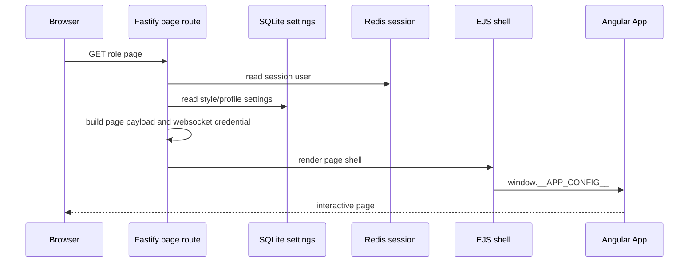
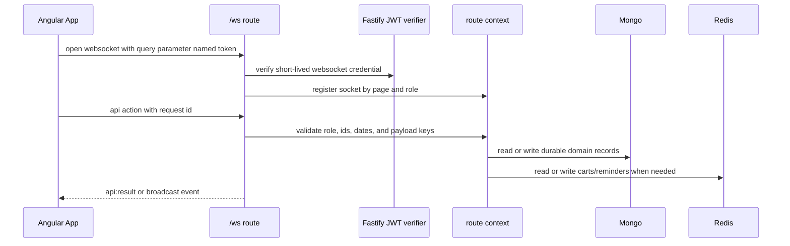
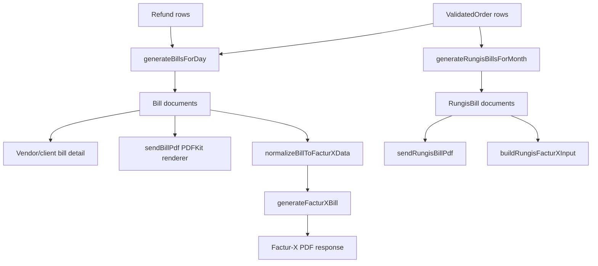

# Architecture

Generated: 2026-06-21 03:29:57 CEST

## Evidence and scope

This document is grounded in the current Rungis source tree and the `codebase-memory` graph.

| Evidence | Value |
|----------|-------|
| Project id | `Volumes-WDBlack4TB-Code-rungis` |
| Root path | `/Volumes/WDBlack4TB/Code/rungis` |
| Index status | `ready` |
| Graph size | 2962 nodes, 4520 edges |
| Graph labels | Section, Variable, Function, File, Module, Method, Route, Folder, Type, Class, Channel, Interface, Project |
| Key trace | `registerRoutes` calls `createRouteContext`, page routes, auth, management, bills, Rungis bills, refunds, and websocket registration |
| Direct sources checked | `package.json`, `backend/package.json`, `frontend/package.json`, `backend/src/server.js`, `backend/src/routes/index.js`, `backend/src/routes/modules/*.js`, `frontend/src/app/app.routes.ts`, `frontend/angular.json` |

## System overview

Rungis is a multi-role B2B market portal for admins, vendors, and clients. It covers account onboarding, admin activation, vendor-client assignment, stock and catalog management, realtime client ordering, Redis-backed carts, order validation, daily bill generation, bill settlement, comments, refunds, reminders, Rungis platform fee bills, statistics, PDF export, Factur-X export, bilingual UI text, passkeys, and style profile selection.

The application is a modular monolith with a hybrid rendering model. Fastify owns runtime boot, session security, page guards, REST routes, WebSocket routing, persistence connections, server-side page shells, and static asset serving. Angular 22 owns the interactive UI once Fastify injects the selected page, session user, translations, style profile, asset paths, and a short-lived websocket credential into `window.__APP_CONFIG__`.

The architecture is intentionally centralized around a shared backend route context and a root Angular `App` component. Backend modules receive an explicit dependency object from `registerRoutes`, while the frontend keeps role/page state in signals inside `App` and uses thin lazy page wrappers to preserve state across routes.

## Component diagram

```mermaid
flowchart LR
    subgraph Browser[Browser]
        Shell[EJS page shell]
        Angular[Angular 22 standalone app]
        App[Root App signals and actions]
        Pages[Thin lazy page wrappers]
    end

    subgraph Backend[Fastify backend]
        Server[server.js bootstrap]
        Register[registerRoutes]
        Context[createRouteContext]
        PageRoutes[Page routes and guards]
        Rest[REST route modules]
        Websocket[/ws websocket module]
        FacturX[Factur-X services]
        RungisBills[Rungis bill services]
    end

    subgraph Stores[Runtime stores]
        Mongo[(MongoDB via Mongoose)]
        Redis[(Redis sessions, carts, reminders)]
        SQLite[(SQLite app settings)]
        Files[(Uploads and Angular build assets)]
    end

    Browser -->|GET page route| PageRoutes
    PageRoutes -->|render appConfig| Shell
    Shell --> Angular
    Angular --> Pages
    Pages -->|inject App| App
    App -->|fetch JSON / files| Rest
    App -->|api action messages| Websocket
    Server --> Register
    Register --> Context
    Register --> PageRoutes
    Register --> Rest
    Register --> Websocket
    Rest --> Context
    Websocket --> Context
    Context --> Mongo
    Context --> Redis
    Context --> SQLite
    Rest --> FacturX
    Rest --> RungisBills
    Server --> Files
```

The critical composition boundary is `backend/src/routes/index.js`. `registerRoutes` creates a single route context, then registers page, auth, management, bill, Rungis bill, refund, and websocket modules. The route modules do not import each other; they consume shared helpers, models, services, guards, and store clients through the dependency object.

## Technology stack

| Category | Technology | Purpose | Evidence |
|----------|------------|---------|----------|
| Runtime | Node.js | Root workspace scripts, backend runtime, test runner | `package.json`, `backend/package.json` |
| Backend framework | Fastify 5 | HTTP server, plugin stack, routes, logger, WebSocket registration | `backend/src/server.js`, `backend/package.json` |
| Frontend framework | Angular 22 | Standalone UI, strict TypeScript, signals, lazy page components | `frontend/package.json`, `frontend/src/app/*` |
| UI styling | Bootstrap 5 and CSS bundles | Base components plus primary and secondary style profiles | `frontend/angular.json`, `frontend/src/styles*.css` |
| Persistent database | MongoDB with Mongoose | Users, merchandise, validated orders, bills, Rungis bills, refunds | `backend/src/models/*.js` |
| Transient store | Redis | Sessions, carts, login cooldowns, unpaid reminders | `backend/src/server.js`, `backend/src/routes/index.js` |
| Local settings | SQLite through `node:sqlite` | Overdue days, app style profile, Rungis billing settings | `backend/src/lib/app-settings-store.js`, `backend/src/services/rungis-bills/settings.js` |
| Server templates | EJS | Page shell rendering and Angular config injection | `backend/src/views/*.ejs`, page route module |
| Authentication | Fastify session, JWT, bcrypt, SimpleWebAuthn | Password login, session cookies, WebSocket credential, passkeys | `backend/src/server.js`, `backend/src/routes/modules/auth.js` |
| Realtime | `@fastify/websocket` | Live stock, catalog, cart, dashboard, bill, and admin events | `backend/src/routes/modules/websocket.js` |
| Documents | PDFKit and Factur-X package | PDF bills and hybrid Factur-X documents | `backend/src/services/factur-x/*`, `backend/src/services/rungis-bills/*` |
| Tests | Node test runner, Vitest, Playwright, k6 | Backend, frontend, functional, and performance checks | `backend/test`, `frontend/src/app/app.spec.ts`, `e2e`, `performance/k6` |

## Directory structure

```text
rungis/
  package.json                    # npm workspaces and root scripts
  backend/
    package.json                  # Fastify backend dependencies and scripts
    fixtures/factur-x/            # Representative invoice fixtures
    scripts/                      # seed, migration, Atlas copy, operations
    src/
      server.js                   # Fastify boot, plugins, connections, listen
      lib/                        # runtime config, security, translations, Angular assets, SQLite settings
      models/                     # Mongoose models for domain entities
      routes/index.js             # shared helpers, route context, registration boundary
      routes/modules/             # page, auth, management, bills, Rungis bills, refunds, websocket
      services/factur-x/          # invoice normalization, PDF/XML generation, validation
      services/rungis-bills/      # platform fee bill settings, generation, view data, PDF rendering
      utils/vat.js                # money and VAT helpers
      views/                      # EJS page shells and partials
      i18n/translations.json      # English and French UI copy
      public/                     # uploaded assets and generated Angular output
    test/                         # backend node:test suites
  frontend/
    angular.json                  # Angular build, test, output path to backend public folder
    src/app/
      app.ts                      # central root component and application state
      app.routes.ts               # lazy route map
      app.types.ts                # frontend view and payload types
      app.view-models.ts          # chart and aggregate builders
      pages/                      # thin page wrappers that delegate to App
      app.spec.ts                 # frontend unit tests
  specs/                          # Spec Kit feature specifications and contracts
  .sdd/docs/                      # generated architecture, API, guide, and evidence docs
  e2e/                            # Playwright functional tests
  performance/k6/                 # smoke, websocket, and load tests
```

## Design decisions

### Decision 1: Modular monolith over microservices

- Decision: Keep HTTP, WebSocket, documents, billing, and admin workflows in one Fastify process.
- Rationale: The domain is tightly coupled around users, vendor-client assignments, carts, orders, bills, and settlement state.
- Consequences: Shared helpers are easy to reuse, but route context size is large and process-level schedulers require care if the backend is scaled horizontally.

### Decision 2: Fastify page shell plus Angular 22 app

- Decision: Fastify renders guarded page shells and Angular renders all interactive content.
- Rationale: Server-side guards, translations, style profile, session user, and websocket credential can be established before the SPA starts.
- Consequences: Frontend build output is coupled to `backend/src/public/angular`, and every page must stay compatible with injected `window.__APP_CONFIG__`.

### Decision 3: REST plus action-multiplexed WebSocket

- Decision: Use REST for page-independent request/response operations and `/ws` action messages for live ordering, stock, dashboard, and bill workflows.
- Rationale: Realtime workflows need broadcast and page registration semantics, while file downloads, admin settings, passkeys, and upload endpoints fit REST better.
- Consequences: WebSocket action names are application contracts and must be tested when changed.

### Decision 4: Three store classes by lifecycle

- Decision: Use MongoDB for durable business records, Redis for sessions and transient realtime state, and SQLite for local app settings.
- Rationale: Each store maps to a different data lifetime and operational concern.
- Consequences: Deployment needs MongoDB and Redis reachability, and SQLite paths must persist across restarts where settings matter.

### Decision 5: Fail-closed billing documents

- Decision: PDF and Factur-X exports normalize and validate party identity, totals, VAT, line items, and bill identifiers before returning documents.
- Rationale: Billing artifacts are accounting evidence and must not silently produce misleading files.
- Consequences: Existing data quality issues surface as explicit export errors instead of partially correct documents.

## Data flow summary

### Page bootstrap



### Realtime API



### Billing and document generation



## Architecture governance

- Treat route names, REST paths, WebSocket actions, model fields, and generated document totals as contracts.
- Add or update tests at the lowest useful boundary before changing billing, WebSocket, auth, or money logic.
- Keep role checks server-side; frontend role checks are only usability hints.
- Re-index `codebase-memory` after structural changes so architecture docs remain grounded.
- Keep generated Angular build artifacts under `backend/src/public/angular`, but do not confuse generated files with source architecture.
