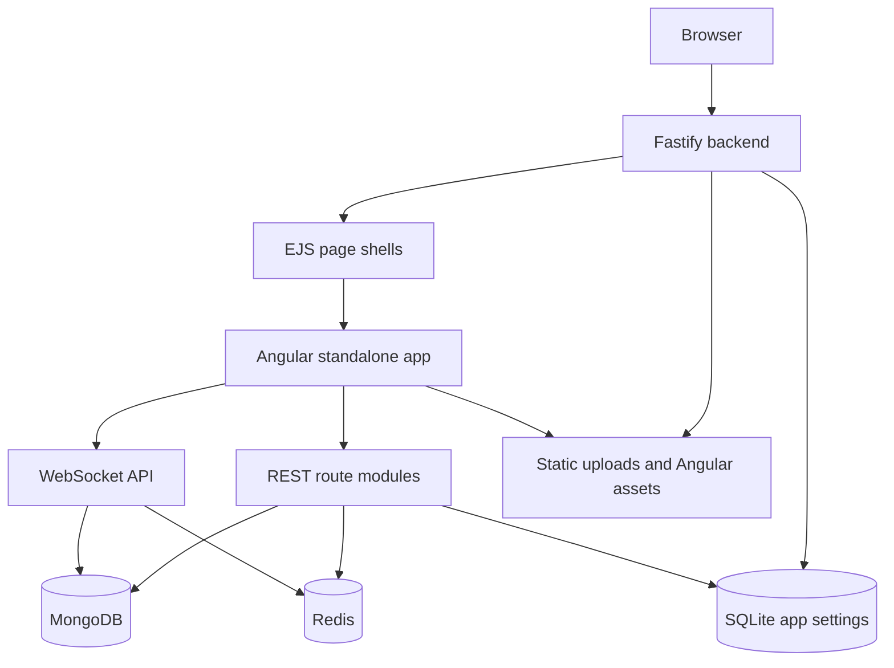
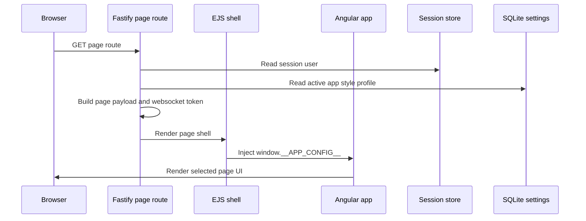
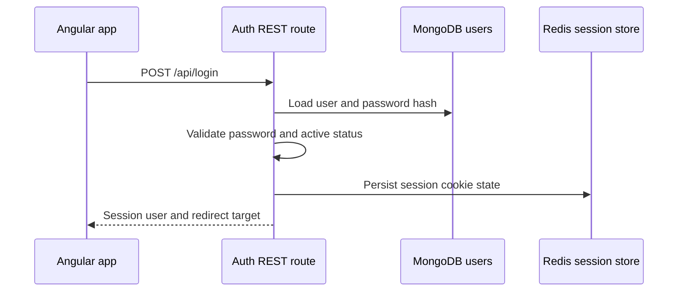
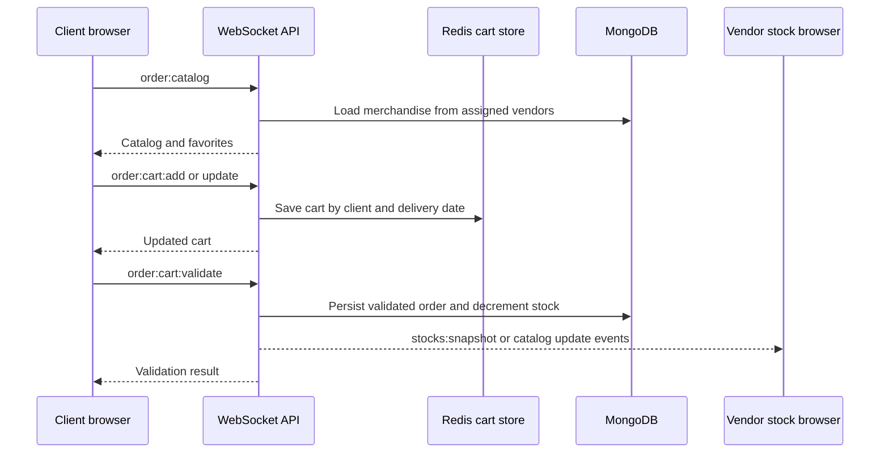
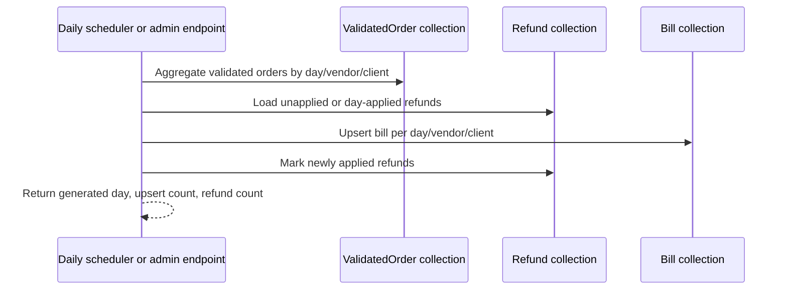
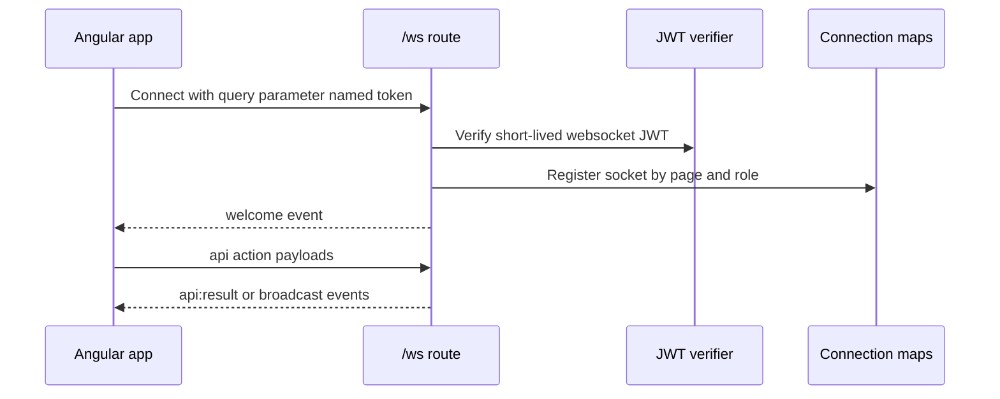

# Architecture

## System Overview

Rungis Portal is a multi-role B2B ordering and billing application for vendors, clients, and administrators. It supports vendor and client onboarding, admin approval, vendor-client assignment, stock management, client ordering, daily bill generation, bill settlement, bill comments, refunds, overdue bill handling, payment reminders, statistics, PDF export, passkeys, bilingual UI text, and global style profile switching.

The application is a Node.js npm workspace with two workspaces: `backend` and `frontend`. The backend is a Fastify 5 application that renders EJS page shells, hosts static assets, serves the Angular build output, exposes REST endpoints, exposes an authenticated WebSocket endpoint, connects to MongoDB through Mongoose, stores sessions and transient realtime state in Redis, and stores local app settings in SQLite. The frontend is a standalone Angular 21 application mounted into the server-rendered shell and driven by Angular signals, fetch calls, and WebSocket API actions.

The runtime model is a hybrid server-rendered shell plus client-side application. Fastify decides the page, language, active style profile, current session user, and WebSocket token, then injects those values as `window.__APP_CONFIG__`. Angular renders the actual interactive page content according to the injected page name and user role.

## Component Diagram



Key relationships:

- `backend/src/server.js` constructs the Fastify app, connects MongoDB and Redis, initializes SQLite-backed settings, registers plugins, registers routes, and starts listening.
- `backend/src/routes/index.js` creates shared dependencies and route context for all route modules.
- `backend/src/routes/modules/pages.js` registers the server-rendered page shell routes.
- `backend/src/routes/modules/auth.js`, `management.js`, `bills.js`, and `refunds.js` register REST endpoints.
- `backend/src/routes/modules/websocket.js` registers `/ws` and multiplexes realtime API actions by `action` string.
- `frontend/src/app/app.ts` is the central Angular component and communicates with REST endpoints and the websocket API.
- `frontend/angular.json` builds the Angular output into `backend/src/public/angular` so the backend can serve it.

## Technology Stack

| Category | Technology | Purpose | Evidence |
|----------|------------|---------|----------|
| Runtime | Node.js | Backend runtime and npm workspace tooling | `package.json`, `backend/package.json` |
| Backend framework | Fastify 5 | HTTP server, plugins, routes, logging, websocket registration | `backend/package.json`, `backend/src/server.js` |
| Frontend framework | Angular 21 | Standalone browser application with strict TypeScript | `frontend/package.json`, `frontend/angular.json`, `frontend/tsconfig.json` |
| UI styling | Bootstrap 5 and custom CSS bundles | Layout and primary/secondary style profiles | `frontend/package.json`, `frontend/angular.json` |
| Database | MongoDB with Mongoose | Persistent users, merchandise, orders, bills, refunds, cart model | `backend/package.json`, `backend/src/models/*.js` |
| Cache/session store | Redis | Fastify session store, live cart JSON, login rate state, unpaid reminders | `backend/src/server.js`, `backend/src/routes/index.js` |
| Local settings | SQLite through `node:sqlite` | App settings such as overdue days and active style profile | `backend/src/lib/app-settings-store.js` |
| Templates | EJS | Server-rendered page shells | `backend/src/server.js`, `backend/src/views/*.ejs` |
| Authentication | Fastify session, JWT, bcrypt, SimpleWebAuthn | Password login, session cookies, websocket token, passkeys | `backend/package.json`, `backend/src/routes/index.js`, `routes/modules/auth.js` |
| Realtime | Fastify websocket plugin | Live catalog, cart, stock, dashboard, and admin updates | `backend/src/routes/modules/websocket.js` |
| PDF | PDFKit | Vendor and client bill exports | `backend/package.json`, `routes/modules/bills.js` |
| Tests | Vitest through Angular build tooling | Frontend component unit tests | `frontend/package.json`, `frontend/src/app/app.spec.ts` |

## Design Decisions

### Decision 1: Hybrid Fastify shell and Angular application

- Decision: Fastify renders page shells and injects bootstrap config; Angular renders interactive UI for the selected page.
- Rationale: The backend can enforce page-level access control, language selection, style selection, and session bootstrap before the frontend starts.
- Alternatives considered: A pure SPA served by Angular dev server, or a fully server-rendered EJS application.
- Consequences: The Angular app is centralized in one component and depends on `window.__APP_CONFIG__`; backend and frontend builds are coupled by the Angular output path.

### Decision 2: REST plus WebSocket multiplexing

- Decision: Use REST for account, admin, reporting, file upload, passkey, PDF, and refund operations, and use `/ws` for realtime actions and stateful dashboard/order/stock operations.
- Rationale: WebSocket keeps ordering, stock, and dashboard updates live while REST keeps conventional request/response operations simple.
- Alternatives considered: REST-only polling, or one endpoint per realtime operation.
- Consequences: WebSocket action names are part of the application contract even though no formal SDD contract file exists.

### Decision 3: MongoDB for business entities, Redis for transient operational state, SQLite for local app settings

- Decision: Use MongoDB/Mongoose for long-lived domain records; Redis for sessions, live carts, ephemeral rate/reminder state; SQLite for local key/value app settings.
- Rationale: Each store matches a different consistency and lifecycle need.
- Alternatives considered: Store all data in MongoDB, or store settings in environment variables only.
- Consequences: Deployment requires MongoDB and Redis, and the local SQLite file must persist across backend restarts when settings matter.

### Decision 4: Role-specific guards at both page and API layers

- Decision: Use server-side guards for admin, vendor, client, and authenticated pages/APIs.
- Rationale: Role restrictions must not rely on the client UI alone.
- Alternatives considered: Frontend-only checks, or a generic policy framework.
- Consequences: New routes must choose the correct guard and must return 401/403 for API access failures.

### Decision 5: Daily bill generation as an in-process scheduler

- Decision: Schedule daily bill generation inside `createRouteContext` and provide an admin endpoint to run it for a chosen day.
- Rationale: The billing job is close to the domain code and can be triggered manually by admins.
- Alternatives considered: External cron, worker process, or database trigger.
- Consequences: Only one active backend process should run the scheduler unless duplicate upserts are acceptable; operations should monitor logs for billing failures.

## Directory Structure

```text
rungis/
  README.md                         # Application overview and quick start
  package.json                      # npm workspace and root scripts
  package-lock.json                 # Locked dependency tree
  backend/
    package.json                    # Fastify backend dependencies and scripts
    .env.example                    # Example backend environment variables
    scripts/                        # Seed and migration scripts
    data/                           # Local SQLite settings database location
    src/
      server.js                     # Fastify bootstrap and plugin registration
      lib/                          # Runtime config, security, translations, assets, app settings
      models/                       # Mongoose schemas and models
      routes/
        index.js                    # Shared domain helpers, billing, context, route registration
        modules/                    # Auth, management, bills, refunds, pages, websocket routes
      views/                        # EJS shells and partials
      i18n/                         # English and French translation JSON
      public/                       # Static assets, uploads, Angular build output
  frontend/
    package.json                    # Angular dependencies and scripts
    angular.json                    # Build, serve, styles, and output path
    tsconfig*.json                  # Strict TypeScript and Angular config
    src/
      main.ts                       # Angular bootstrap
      index.html                    # Browser document
      styles*.css                   # Primary, secondary, and shared styles
      app/
        app.ts                      # Central standalone Angular component
        app.html                    # Template for all pages
        app.css                     # Component styles
        app.types.ts                # Frontend data types
        app.constants.ts            # Supported pages, languages, roles, defaults
        app.utils.ts                # Shared frontend utilities
        webauthn-client.ts          # Lazy SimpleWebAuthn browser helpers
        app.spec.ts                 # Vitest/Angular unit tests
  .sdd/docs/                        # Generated documentation from this workflow
```

## Data Flow

### Page bootstrap flow



### Login and session flow



### Client ordering flow



### Daily billing flow



### Realtime notification flow


