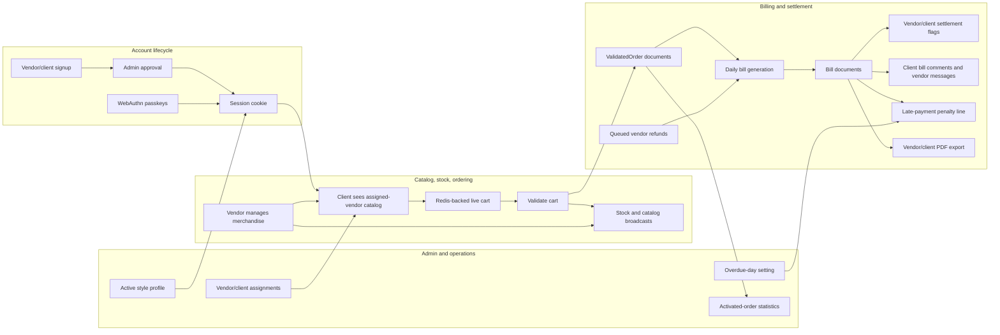

# Rungis Technical Application Diagram

Generated from codebase-memory and direct source inspection.

Codebase-memory evidence:

- Project id: `Volumes-WDBlack4TB-Code-rungis`
- Root path: `/Volumes/WDBlack4TB/Code/rungis`
- Index status: `ready`
- Graph size: 2617 nodes and 10018 edges
- Schema highlights: 1186 Function nodes, 352 Method nodes, 46 File nodes, 46 Module nodes, 3 Channel nodes
- Route trace evidence: `registerRoutes` calls `createRouteContext`, `registerPageRoutes`, `registerAuthRoutes`, `registerManagementRoutes`, `registerBillRoutes`, `registerRefundRoutes`, and `registerWebsocketRoutes`
- Source evidence: `backend/src/server.js`, `backend/src/routes/index.js`, `backend/src/routes/modules/*.js`, `frontend/src/app/app.ts`, `frontend/src/app/app.routes.ts`, `frontend/src/app/pages/*.component.ts`, `.sdd/docs/evidence.md`, `.sdd/docs/runtime-api-inventory.md`

## 1. Runtime container view

```mermaid
flowchart LR
    subgraph Users[Users]
        Admin[Admin]
        Vendor[Vendor]
        Client[Client]
    end

    subgraph Browser[Browser]
        Shell[EJS page shell]
        Angular[Angular 21 standalone app]
        LazyRoutes[Lazy routed page components]
        AppState[Root App state and signals]
        Theme[Client theme plus server style profile]
    end

    subgraph Backend[Fastify 5 backend]
        Server[server.js bootstrap]
        Pages[Page routes and guards]
        Rest[REST route modules]
        WS[/ws authenticated WebSocket]
        RouteContext[Route context and domain helpers]
        Security[Security headers, sessions, JWT, rate guards]
        Static[Static uploads and Angular assets]
    end

    subgraph Stores[Runtime stores]
        Mongo[(MongoDB via Mongoose)]
        Redis[(Redis sessions, live carts, rate state, reminders)]
        SQLite[(SQLite app settings)]
        Files[(Uploaded logos, item images, Angular build)]
    end

    Admin --> Browser
    Vendor --> Browser
    Client --> Browser

    Browser -->|GET page route| Pages
    Pages -->|buildPagePayload| RouteContext
    Pages -->|render appConfig| Shell
    Shell -->|window.__APP_CONFIG__| Angular
    Angular --> LazyRoutes
    LazyRoutes -->|inject App and activateRoutedPage| AppState
    Angular -->|fetch| Rest
    Angular -->|short-lived JWT token| WS

    Server --> Pages
    Server --> Rest
    Server --> WS
    Server --> Security
    Server --> Static

    Rest --> RouteContext
    WS --> RouteContext
    RouteContext --> Mongo
    RouteContext --> Redis
    RouteContext --> SQLite
    Static --> Files
    Rest --> Files

    RouteContext -->|PDF export| Rest
    RouteContext -->|broadcast updates| WS
```

## 2. Backend component view

```mermaid
flowchart TB
    Server[backend/src/server.js]

    subgraph Plugins[Fastify plugin stack]
        Cookie[@fastify/cookie]
        FormBody[@fastify/formbody]
        Jwt[@fastify/jwt]
        Session[@fastify/session + RedisStore]
        Websocket[@fastify/websocket]
        View[@fastify/view + EJS]
        StaticPlugin[@fastify/static]
        Headers[registerSecurityHeaders]
    end

    subgraph Routing[backend/src/routes]
        Register[registerRoutes]
        Context[createRouteContext]
        PageRoutes[modules/pages.js]
        AuthRoutes[modules/auth.js]
        MgmtRoutes[modules/management.js]
        BillRoutes[modules/bills.js]
        RefundRoutes[modules/refunds.js]
        WsRoutes[modules/websocket.js]
    end

    subgraph Domain[Shared domain helpers]
        Guards[requireAuth / requireAdmin / requireVendor / requireClient]
        Billing[generateBillsForDay]
        Bills[Bill details, settlement, comments, penalties]
        Carts[Redis cart helpers]
        Catalog[Merchandise mapping and broadcasts]
        WebAuthn[Passkey option and verification helpers]
        Settings[Overdue days and style profile settings]
        Pdf[PDFKit bill export]
    end

    subgraph Models[Mongoose models]
        User[User]
        Merchandise[Merchandise]
        ValidatedOrder[ValidatedOrder]
        Bill[Bill]
        Refund[Refund]
        Cart[Cart model exists; active carts use Redis]
    end

    Server --> Plugins
    Server --> Register
    Register --> Context
    Register --> PageRoutes
    Register --> AuthRoutes
    Register --> MgmtRoutes
    Register --> BillRoutes
    Register --> RefundRoutes
    Register --> WsRoutes

    PageRoutes --> Guards
    AuthRoutes --> Guards
    MgmtRoutes --> Guards
    BillRoutes --> Guards
    RefundRoutes --> Guards
    WsRoutes --> Guards

    Context --> Billing
    Context --> Bills
    Context --> Carts
    Context --> Catalog
    Context --> WebAuthn
    Context --> Settings
    Context --> Pdf

    Billing --> ValidatedOrder
    Billing --> Refund
    Billing --> Bill
    Bills --> Bill
    Carts --> Redis[(Redis)]
    Catalog --> Merchandise
    WebAuthn --> User
    Settings --> SQLite[(SQLite)]
    AuthRoutes --> User
    MgmtRoutes --> User
    MgmtRoutes --> Merchandise
    RefundRoutes --> Refund
    BillRoutes --> Pdf
```

## 3. Frontend component and state-preserving lazy route view

```mermaid
flowchart TB
    Main[frontend/src/main.ts]
    Config[app.config.ts provideRouter]
    Routes[app.routes.ts]
    Root[App root component]
    Header[AppHeaderComponent]
    Toasts[ToastStackComponent]
    Template[app.html shared shell]

    subgraph LazyPages[Lazy-loaded standalone page wrappers]
        Dashboard[DashboardPageComponent]
        Admin[AdminPageComponent]
        Statistics[StatisticsPageComponent]
        Stocks[StocksPageComponent]
        Order[OrderPageComponent]
        Legacy[LegacyPagePlaceholderComponent]
    end

    subgraph RootState[Root App-owned state]
        Session[sessionUser, role, language]
        DashboardState[dashboard filters, bill selections, vendorBillsTab]
        AdminState[pending users, associations, settings]
        OrderState[catalog, filters, cart, delivery date]
        StockState[merchandise, stock forms]
        BillingState[selectedVendorBillClientId, bill details, refunds, reminders]
        WsState[websocket connection and request map]
    end

    subgraph IO[Browser I/O]
        Fetch[REST fetch calls]
        Socket[WebSocket API calls]
        Bootstrap[window.__APP_CONFIG__]
        Theme[style profile and local theme mode]
    end

    Main --> Config
    Config --> Routes
    Config --> Root
    Root --> Header
    Root --> Toasts
    Root --> Template
    Template --> Routes
    Routes --> Dashboard
    Routes --> Admin
    Routes --> Statistics
    Routes --> Stocks
    Routes --> Order
    Routes --> Legacy

    Dashboard -->|inject App; activateRoutedPage('dashboard')| Root
    Admin -->|inject App; activateRoutedPage('admin')| Root
    Statistics -->|inject App; activateRoutedPage('statistics')| Root
    Stocks -->|inject App; activateRoutedPage('stocks')| Root
    Order -->|inject App; activateRoutedPage('order')| Root
    Legacy -->|activate legacy page from config| Root

    Root --> RootState
    RootState --> Fetch
    RootState --> Socket
    Bootstrap --> Root
    Theme --> Root
```

## 4. Business data and event-flow view



## 5. Page-to-backend interaction map

```mermaid
flowchart TB
    subgraph Pages[Browser pages]
        Login[/login and /subscribe]
        Dashboard[/dashboard]
        Admin[/admin]
        Statistics[/statistics]
        Stocks[/stocks]
        VendorReports[/vendor-statistics, /vendor-monthly-summary, /vendor-overdue-bills, /vendor-refunds]
        FindVendors[/find-vendors]
        Order[/order]
        Account[/account]
    end

    subgraph REST[REST modules]
        Auth[auth.js]
        Management[management.js]
        Bills[bills.js]
        Refunds[refunds.js]
    end

    subgraph Realtime[websocket.js actions]
        WsAuth[auth:username-available]
        WsDashboard[dashboard:*]
        WsStocks[stocks:*]
        WsOrder[order:*]
        Broadcasts[order/catalog/stock/reminder/message broadcasts]
    end

    Login --> Auth
    Login --> WsAuth
    Account --> Auth
    Admin --> Management
    Statistics --> Management
    VendorReports --> Management
    VendorReports --> Refunds
    Dashboard --> WsDashboard
    Dashboard --> Bills
    Stocks --> WsStocks
    Stocks --> Auth
    Order --> WsOrder
    FindVendors --> Management
    Bills -->|PDF responses| Dashboard
    WsOrder --> Broadcasts
    WsStocks --> Broadcasts
    Management --> Broadcasts
```

## 6. Architectural notes for future changes

- Keep server page guards authoritative. Frontend role checks improve UX, but `pages.js` and API route guards are the security boundary.
- Keep lazy page wrappers thin. They should inject `App`, call `activateRoutedPage`, and delegate state/behavior to the root App until a dedicated state service is introduced.
- Preserve App-owned page state when adding routes that should not reset user context, especially fields such as selected bill/client filters, active tabs, cart state, and dashboard ranges.
- Treat `/ws` action names and REST endpoints as application contracts even though they are currently implementation-derived rather than formal OpenAPI/SDD contracts.
- If backend domain logic grows further, `routes/index.js` is the main decomposition candidate: billing, carts, bill details, WebAuthn, and settings can become explicit services with narrow interfaces.
