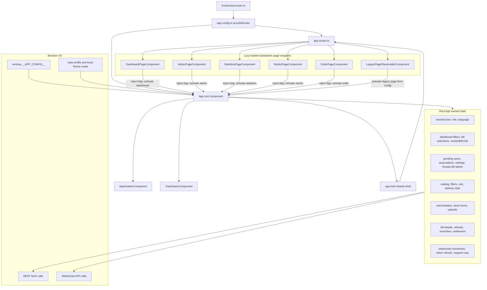
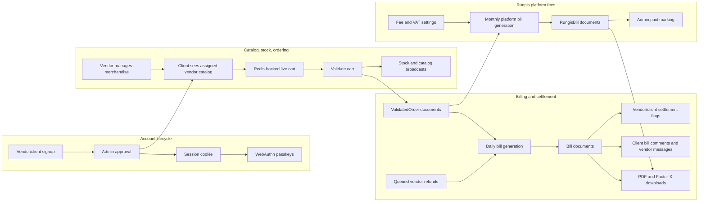
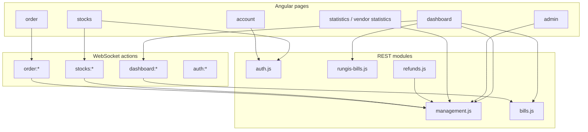

# Rungis Technical Application Diagram

Generated: 2026-06-21 03:29:57 CEST

## Codebase-memory evidence

- Project id: `Volumes-WDBlack4TB-Code-rungis`
- Root path: `/Volumes/WDBlack4TB/Code/rungis`
- Index status: `ready`
- Graph size: 2962 nodes and 4520 edges
- Schema highlights: 305 Function nodes, 197 Method nodes, 216 File nodes, 216 Module nodes, 72 Route nodes, 4 Channel nodes
- Route trace evidence: `registerRoutes` calls `createRouteContext`, `registerPageRoutes`, `registerAuthRoutes`, `registerManagementRoutes`, `registerBillRoutes`, `registerRungisBillRoutes`, `registerRefundRoutes`, and `registerWebsocketRoutes`
- Source evidence: `backend/src/server.js`, `backend/src/routes/index.js`, `backend/src/routes/modules/*.js`, `frontend/src/app/app.ts`, `frontend/src/app/app.routes.ts`, `frontend/src/app/pages/*.component.ts`, `frontend/angular.json`

## 1. Runtime container view

```mermaid
flowchart LR
    subgraph Users[Users]
        Admin[Admin]
        Vendor[Vendor]
        Client[Client]
    end

    subgraph Browser[Browser]
        Shell[EJS page shell]
        Angular[Angular 22 standalone app]
        LazyRoutes[Lazy routed page components]
        AppState[Root App state and signals]
        Theme[Theme mode and style profile]
    end

    subgraph Backend[Fastify 5 backend]
        Server[server.js bootstrap]
        Pages[Page routes and guards]
        Rest[REST route modules]
        WS[/ws authenticated WebSocket]
        RouteContext[Route context and domain helpers]
        Security[Security headers, sessions, JWT, rate guards]
        Static[Static uploads and Angular assets]
        Documents[PDF and Factur-X services]
    end

    subgraph Stores[Runtime stores]
        Mongo[(MongoDB via Mongoose)]
        Redis[(Redis sessions, live carts, rate state, reminders)]
        SQLite[(SQLite app settings)]
        Files[(Uploaded logos, item images, Angular build)]
    end

    Admin --> Browser
    Vendor --> Browser
    Client --> Browser
    Browser -->|GET page route| Pages
    Pages -->|buildPagePayload| RouteContext
    Pages -->|render appConfig| Shell
    Shell -->|window.__APP_CONFIG__| Angular
    Angular --> LazyRoutes
    LazyRoutes -->|inject App and activateRoutedPage| AppState
    Angular -->|fetch| Rest
    Angular -->|short-lived websocket credential| WS
    Server --> Pages
    Server --> Rest
    Server --> WS
    Server --> Security
    Server --> Static
    Rest --> RouteContext
    WS --> RouteContext
    Rest --> Documents
    Documents --> RouteContext
    RouteContext --> Mongo
    RouteContext --> Redis
    RouteContext --> SQLite
    Static --> Files
    Rest --> Files
    RouteContext -->|broadcast updates| WS
```

## 2. Backend component view

```mermaid
flowchart TB
    Server[backend/src/server.js]

    subgraph Plugins[Fastify plugin stack]
        Cookie[@fastify/cookie]
        FormBody[@fastify/formbody]
        Jwt[@fastify/jwt]
        Session[@fastify/session + RedisStore]
        Websocket[@fastify/websocket]
        View[@fastify/view + EJS]
        StaticPlugin[@fastify/static]
        Headers[registerSecurityHeaders]
    end

    subgraph Routing[backend/src/routes]
        Register[registerRoutes]
        Context[createRouteContext]
        PageRoutes[modules/pages.js]
        AuthRoutes[modules/auth.js]
        MgmtRoutes[modules/management.js]
        BillRoutes[modules/bills.js]
        RungisBillRoutes[modules/rungis-bills.js]
        RefundRoutes[modules/refunds.js]
        WsRoutes[modules/websocket.js]
    end

    subgraph Services[Service modules]
        FacturXData[factur-x/invoice-data.js]
        FacturXGenerator[factur-x/generator.js]
        FacturXValidation[factur-x/validation.js]
        RungisGen[rungis-bills/generation.js]
        RungisSettings[rungis-bills/settings.js]
        RungisInvoice[rungis-bills/invoice-data.js]
        RungisPdf[rungis-bills/pdf.js]
        Vat[utils/vat.js]
    end

    subgraph Models[Mongoose models]
        User[User]
        Merchandise[Merchandise]
        ValidatedOrder[ValidatedOrder]
        Bill[Bill]
        Refund[Refund]
        RungisBill[RungisBill]
        Cart[Cart legacy model]
    end

    Server --> Plugins
    Server --> Register
    Register --> Context
    Register --> PageRoutes
    Register --> AuthRoutes
    Register --> MgmtRoutes
    Register --> BillRoutes
    Register --> RungisBillRoutes
    Register --> RefundRoutes
    Register --> WsRoutes
    Context --> Models
    Context --> Vat
    BillRoutes --> FacturXData
    BillRoutes --> FacturXGenerator
    BillRoutes --> FacturXValidation
    RungisBillRoutes --> RungisInvoice
    RungisBillRoutes --> RungisPdf
    RungisBillRoutes --> FacturXGenerator
    MgmtRoutes --> RungisGen
    MgmtRoutes --> RungisSettings
    WsRoutes --> Models
    RefundRoutes --> Refund
```

## 3. Frontend lazy-route and state view



## 4. Business data and event-flow view



## 5. Page-to-backend interaction map


